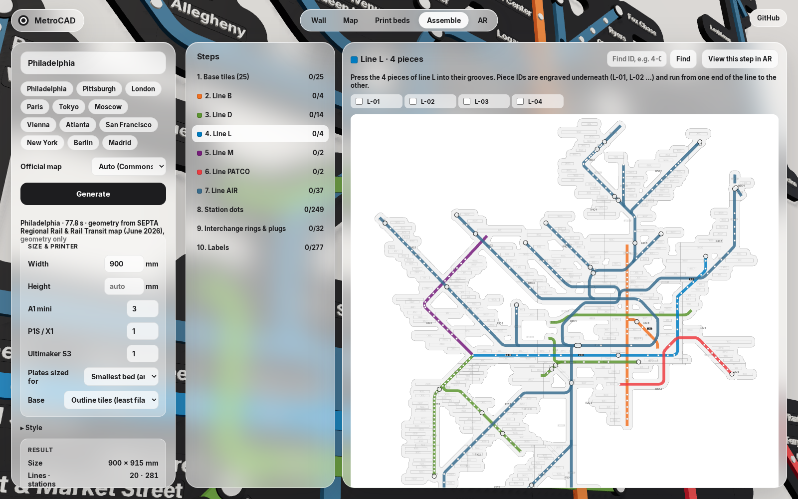
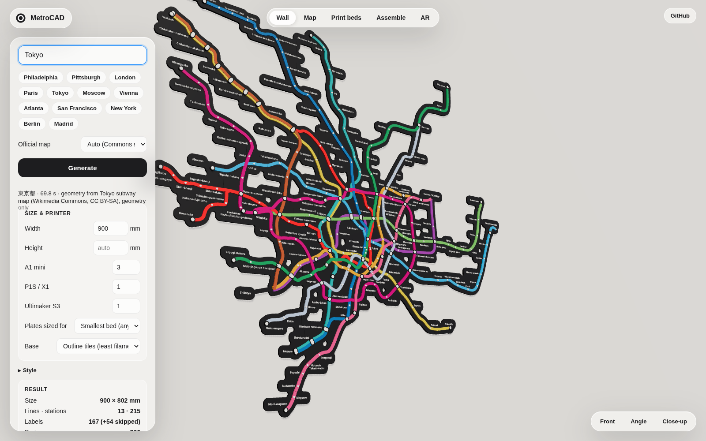
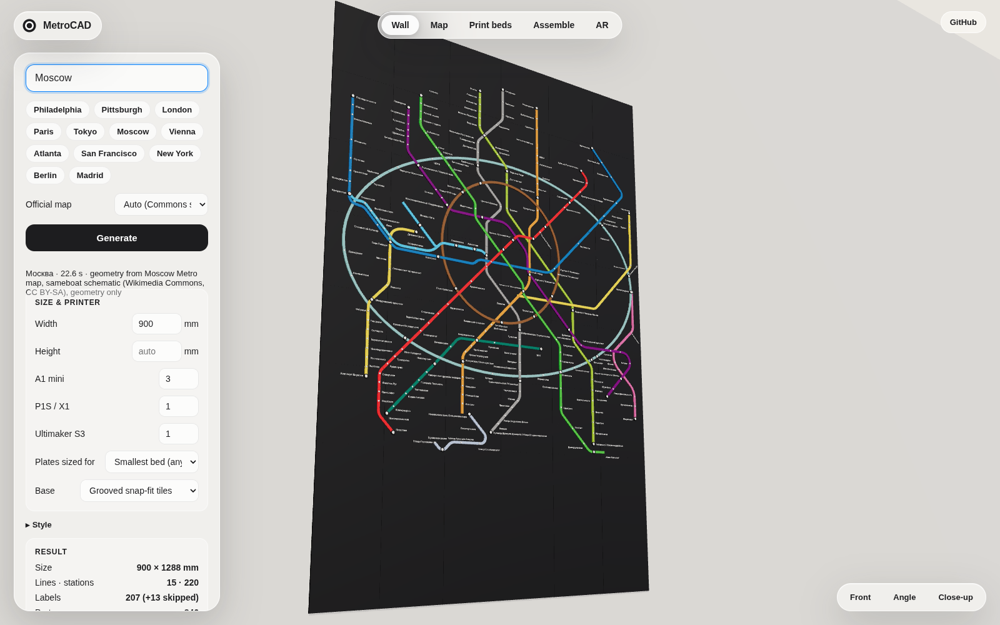
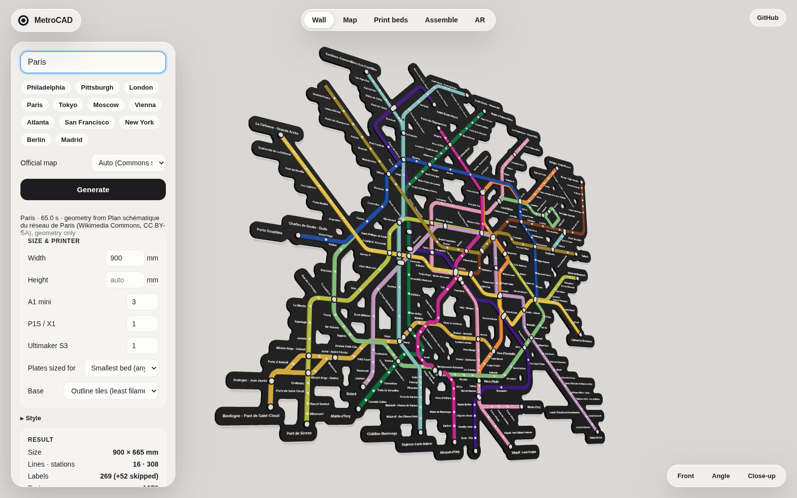
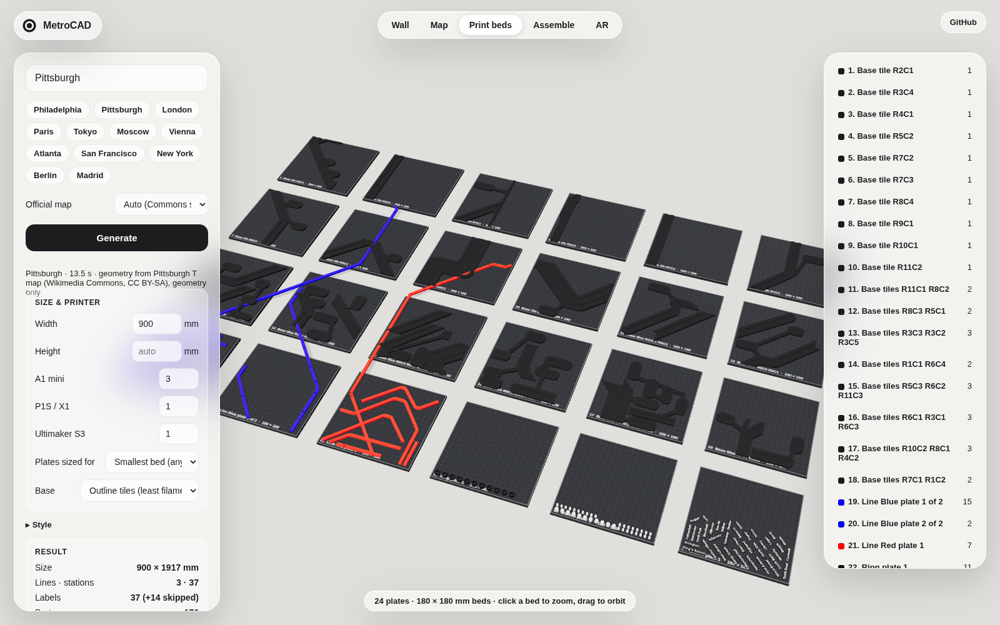

# MetroCAD

**Type a city, get a colour 3D-printable metro map for your wall: STL/3MF/G-code, a print-farm plan, and a 3D + AR preview.**

Live app: **https://gitter499.github.io/metrocad/** (open on a phone for AR).

<p align="center">
  
</p>

| Close-up | Print beds |
|---|---|
|  |  |
|  |  |

## Cities

Every bundled city is built on the operator's own diagram or a Commons redraw of it: line paths, colours, station positions and label placement come from the drawing. `docs/verification-<city>.md` and `docs/screenshots/verify-<city>.png` compare each one with the source, side by side.

| City | Source | Stations placed |
|---|---|---|
| Philadelphia (default) | SEPTA Regional Rail & Rail Transit map, 2026 | 280 / 524 (rest are trolley surface stops SEPTA omits) |
| Paris | Plan schématique du réseau, 2024 (Commons) | 308 / 321 |
| London | Underground, Overground, DLR, Elizabeth line (Commons) | 267 / 267 |
| Moscow | Moscow Metro schematic (Commons) | 220 / 220 |
| Tokyo | Tokyo Metro + Toei (Commons) | 215 / 221 |
| Vienna | U-Map Vienna (Commons) | 98 / 99 |
| Atlanta | MARTA rail map (Commons) | 41 / 43 |
| San Francisco | BART map (Commons, older diagram) | 38 / 49 |
| Pittsburgh | Pittsburgh T (Commons, pre-Silver diagram) | 37 / 51 |


| London | Tokyo |
|---|---|
|  |  |
|  |  |

Any other city is geocoded and pulled from OpenStreetMap and laid out automatically; you can also upload the operator's SVG.

## What you get

- **Plates**: one `.3mf` and `.stl` per plate, parts nested by shape, one colour per plate (labels: two colours, one filament change).
- **G-code**: built-in slicer for Bambu A1 mini, P1S/X1, Ultimaker S3 and Marlin, plus a schedule across your farm.
- **Assembly**: every piece has an engraved ID; `assembly-plan.svg`, per-line step sheets, and an in-app Assemble mode with per-step AR.
- **Previews**: `.glb`/`.usdz` (AR), `map.svg`, 1:1 `template.svg`.

## Design

- **Base**: printed only where the map is. The footprint of grooves, station pockets and label pockets (+8 mm) is cut into as few bed-sized pieces as possible and small pieces share plates. Pittsburgh at 900 mm: 30 tiles, 8 % of the wall rectangle, 368 g instead of 3.4 kg. `--base tiles` gives full rectangles.
- **Lines**: 6 mm ribbons in grooves, cut under interchange markers, half-lapped where they cross; pieces across a seam lock the tiles together.
- **Stations**: white dots through the ribbon; interchanges are a black ring with a white plug.
- **Labels**: plate in the base colour with raised letters, never below 4 mm, placed without overlaps.
- Everything is snap-fit (0.1 mm interference), 0.4 mm nozzle, PLA. Only the tiles are fixed to the wall.

| Outline base, Pittsburgh 900 mm |
|---|
|  |

`docs/matrix.md` lists parts, plates, filament, cost, print hours for 1 to 11 printers and assembly time for every city at 600 / 900 / 1200 mm.

## Run it

```
npm install
npm run build -w @metrocad/core
npm run dev                                   # web app, http://localhost:5173
npm run cli -- "Berlin" --width 1000 --out out/berlin
npm run cli -- --fixture london --width 1200 --slice --farm bambu-a1-mini:3,ultimaker-s3:1
node packages/cli/bin/metrocad.js --help
```

CLI options: `--width/--height`, `--farm`, `--bed`, `--slice`, `--modes`, `--labels all|major|none`, `--label-mode print|tape`, `--lang local|en`, `--base outline|tiles|none`, `--base-margin`, `--keyholes`, `--line-width`, `--clearance`, `--font` (CJK), `--map-svg`, `--no-official`, `--zip`.

## Layout of the repo

```
packages/core   pipeline: osm → network → layout → geometry (manifold-3d) → pack → slice → export
  svgimport.ts  official-map import        tiling.ts   outline-base tiling
  official/     operator station lists     verify.ts   Wikidata cross-check
packages/cli    metrocad command
apps/web        Vite app: worker pipeline, three.js previews, model-viewer AR
scripts/        official-sync, verify-official, matrix, screenshots
```

Workflows: **CI** (tests + CLI build), **Pages** (deploys `apps/web`), **Verify** (re-imports every official map and commits the reports).

Map data © OpenStreetMap contributors (ODbL). Diagrams from Wikimedia Commons are CC BY-SA. Font: Inter (OFL). Code: MIT.
