# MetroCAD

**Type a city. Get a colour 3D-printed schematic metro map for your wall — STL, 3MF, G-code, a print-farm plan, and a 3D + AR preview. No app to install.**

<p align="center">
  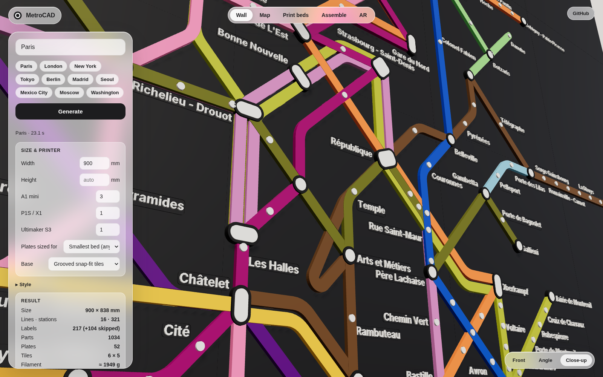
</p>

MetroCAD pulls the real network from OpenStreetMap, lays it out as an abstract octilinear diagram (the "tube map" look), turns every line, station, interchange and label into snap-fit 3D-printable parts with engraved IDs, nests them onto your printers' beds, slices them for each machine in your farm, schedules the jobs, and walks you through assembly with AR. Everything runs in the browser or from the command line.

Verified against the web: every bundled network is checked against Wikipedia/Wikidata line facts (station counts, termini, colours, links to the official route diagrams on Commons) by a GitHub Action — see [docs/verification.md](docs/verification.md). That check covers the *data*; for the *look*, use the official-map import below and compare side by side.

## Live app

**https://gitter499.github.io/metrocad/** — the Pages workflow builds the app and pushes it to the `gh-pages` branch on every push. One-time setup: in the repository *Settings → Pages* set **Source: Deploy from a branch → `gh-pages` / root**; after that every push redeploys.

Open it on a phone for AR: iPhone/iPad uses AR Quick Look (USDZ, anchored to a vertical wall at true size), Android uses Scene Viewer / WebXR. No developer account, TestFlight or app store needed.

<p align="center">
  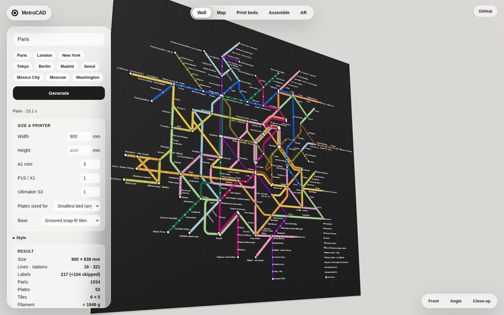
  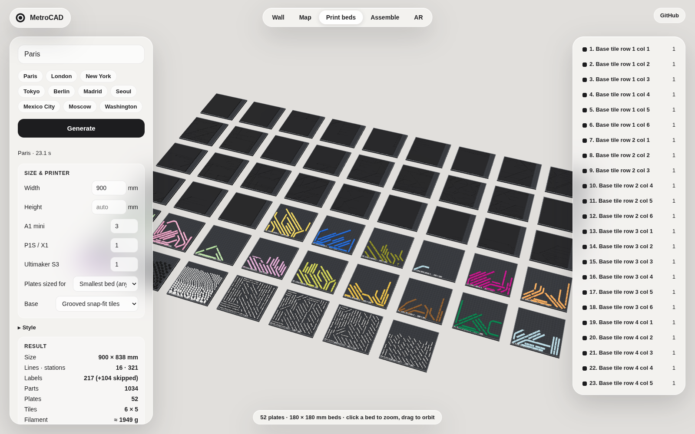
</p>

## Official-map geometry

Algorithms can only produce a map *in the style of* a transit diagram. To get the real thing, MetroCAD imports the official (or community-drawn official-style) diagram as SVG and uses its geometry directly: line paths are picked by colour, stations are placed at their tick marks / interchange markers by name, and labels sit exactly where the drawing puts them. The 3D parts, plates, slicing and assembly plan are then built from that geometry.

* **Auto**: for known cities the app fetches the Commons schematic (currently London: *London Underground, Overground, DLR and Elizabeth line map*, CC BY-SA). Add more in `KNOWN_MAP_SVGS`.
* **My SVG**: upload any official SVG (or `--map-svg file.svg` on the CLI). Operators often publish their diagrams as SVG/PDF; a PDF can be converted with Inkscape.
* **Generated layout**: the algorithmic fallback for cities without a drawing. *Auto* picks strict octilinear for small networks (≤ 6 lines — the way SEPTA, PRT and most US operators draw theirs, horizontals/verticals preferred, diagonals only for genuinely diagonal runs) and semi-geographic for big ones (Paris-style).

Philadelphia and Pittsburgh: Wikimedia Commons has no vector schematic of SEPTA Metro or the Pittsburgh T (only a regional map and a PNG), so the bundled renders use the octilinear generator. SEPTA and PRT publish their official diagrams as PDF; open the PDF in Inkscape, save as SVG, and load it with **Official map → My SVG file** (or `--map-svg`) to get the exact official geometry.

| Source drawing (Commons) | MetroCAD import (all 267 stations, 11 lines matched) |
|---|---|
| 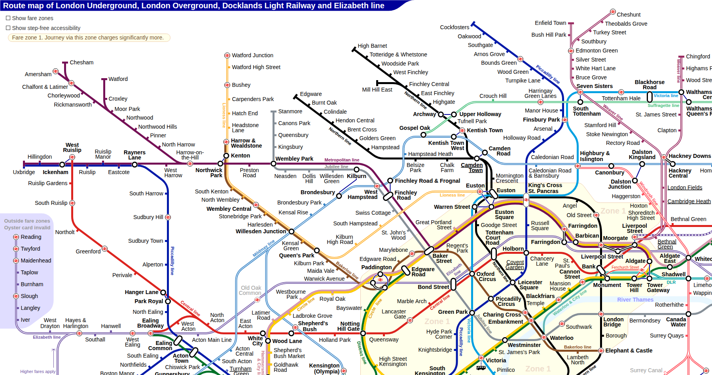 | 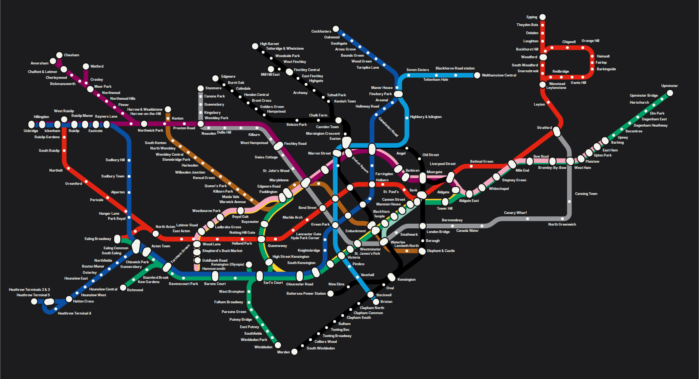 |

## What you get

| Output | Details |
|---|---|
| **Print plates** | One `.3mf` (with colours) and one `.stl` per plate, parts already nested as tightly as the shapes allow (bitmap nesting with 0/45/90/135° rotations, 2.5 mm gaps). One colour per plate; label plates are two colours with a single filament change. |
| **G-code** | Built-in slicer: 0.2 mm layers, 2 walls, 8 % grid infill (minimum material), skirt, retraction, z-hop, fan and temperature control. Flavours for **Bambu Lab A1 mini**, **Bambu Lab P1S/X1**, **Ultimaker S3** (Griffin header) and generic Marlin. |
| **Print-farm plan** | Tell it what you have (e.g. 3 × A1 mini, 1 × P1S, 1 × Ultimaker S3). Plates are packed to fit every bed, each plate is sliced for the printer it is scheduled on, and the schedule reports wall-clock time for the whole map. |
| **Assembly** | Every tile, line piece, ring/plug and label carries an engraved ID (R2C3, 4-07, S014, N017). `assembly/plan.json` + `assembly-plan.svg` show where each ID goes; the web app's **Assemble** mode has step-by-step checklists, an ID finder, and per-step AR overlays (grey tiles + this step's pieces in colour) that you place on the real tiles at true size. |
| **Parts** | Optionally every individual part as its own STL, sorted into `tiles/`, `lines/<line>/`, `stations/`, `labels/`. |
| **Previews** | Assembled `.glb` and `.usdz` (AR), a vector `map.svg`, and a 1:1 `template.svg` alignment template. |
| **Guide** | `README.md` in the bundle: plate list, filament per colour, colour-change heights, print settings, assembly steps. `manifest.json` has everything machine-readable. |

## How the physical design works

Every part is a 2.5D extrusion generated with [manifold-3d](https://github.com/elalish/manifold) (robust CSG, guaranteed watertight meshes). Defaults are for a 0.4 mm nozzle in matte PLA.

* **Base tiles** (4 mm) split to fit your bed. The top face carries **1.2 mm grooves** shaped exactly like the line ribbons, **pockets** for every station marker, and **pockets** for every label. Parts drop in and register themselves; nothing needs measuring.
* **Snap-fit**: every piece has small friction lugs on its foot (0.1 mm interference beyond the clearance), so line pieces, dots, rings, plugs and labels click into their grooves and pockets without glue. Only the tiles need to be fixed to the wall (a Command strip or two per tile).
* **Line ribbons** (6 mm wide, 2 mm above the tile) are cut at interchanges — the joint is hidden under the interchange marker — and, only when a run is longer than the bed, at a straight section between stations. Pieces that cross a tile seam lock the tiles together. Where two lines cross, the pieces are **half-lapped** so both stay in one plane.
* **Stations**: single-line stations are a white dot dropped through a hole in the ribbon into a pocket in the tile. Interchanges are a black ring plus a white plug (pill-shaped when several parallel lines meet).
* **Labels**: a plate in the base colour with raised letters (0.8 mm) in the accent colour — printed as one object with one filament change at 1.0 mm, so it disappears into the tile and only the letters show. When the text would be too small to print well (< 4.5 mm, or on request) the tiles get shallow pockets sized for **label-maker tape** (6–24 mm) instead, and the bundle includes `labels-tape.csv` with every text to print.
* Clearance between mating parts is 0.15 mm (adjustable).

Sizes scale with the wall-art width you ask for; text, line width and clearances stay in real millimetres so they always print.

## Web app

```
npm install
npm run build -w @metrocad/core
npm run dev            # http://localhost:5173
```

Pick a city (or type any city name — it geocodes with Nominatim and pulls routes from Overpass), set the size and your printer farm, press **Generate**. Tabs: **Wall** (3D preview with Front / Angle / Close-up), **Map** (vector), **Print beds** (every plate on its bed in 3D, click to zoom), **Assemble** (steps, checklist, ID finder, per-step AR), **AR** (the finished map on your wall). Downloads: the full print bundle as a ZIP; after **Slice**, G-code for every plate per printer plus the schedule.

<p align="center">
  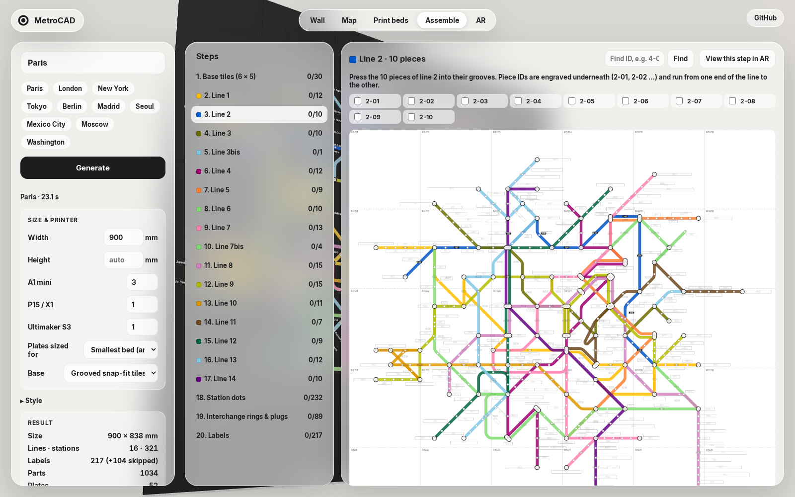
  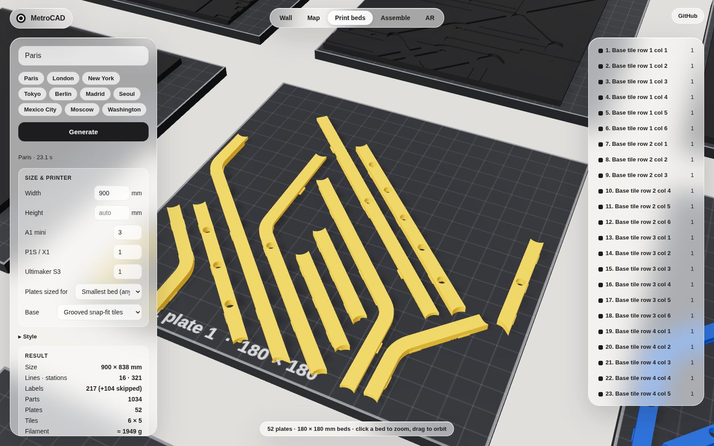
</p>

## Command line

```
npm run cli -- "Berlin" --width 1000 --out out/berlin
npm run cli -- --fixture london --width 1200 --labels major
node packages/cli/bin/metrocad.js --help
```

Options: `--width/--height` (mm), `--farm bambu-a1-mini:3,bambu-p1s:1,ultimaker-s3:1`, `--slice` (G-code + schedule), `--bed 180x180`, `--modes subway,light_rail,tram`, `--labels all|major|none`, `--label-mode auto|print|tape`, `--tape-width 12`, `--label-size 5.5`, `--lang local|en`, `--base tiles|none`, `--keyholes`, `--layout schematic|geographic`, `--line-width 6`, `--clearance 0.15`, `--font Noto-Sans-JP.ttf` (for CJK names), `--save-network`, `--zip`.

Verification: `node scripts/verify.mjs paris` (built-in facts) and `node scripts/verify-web.mjs` (live Wikipedia/Wikidata check, writes `docs/verification.md`).

## Architecture

```
packages/core   TypeScript library (Node + browser)
  osm.ts          Nominatim + Overpass (endpoint fallback), raw relation parsing
  network.ts      station merging, one Line per route_master, colours
  layout/         station graph → corridors → octilinear force layout → grid snap →
                  straightening → parallel offsets → fillets → bed splits → labels
  geometry.ts     manifold-3d parts: tiles, ribbons, half-laps, rings, plugs, dots, labels,
                  snap-fit feet, engraved IDs
  pack.ts         shape-aware bitmap nesting onto plates
  slicer/         G-code slicer (profiles, slicing, motion-time estimate, farm scheduler)
  farm.ts         slice each plate for the printer it is scheduled on
  assembly.ts     piece IDs → tiles/positions, step list, plan SVG, tape-label CSV
  verify.ts       Wikidata/Wikipedia cross-check of lines, stations, termini, colours
  export/         STL, 3MF, GLB, USDZ writers · bundle.ts assembles the ZIP + guide
packages/cli    metrocad command
apps/web        Vite app: worker runs the pipeline, three.js previews, model-viewer AR
```

Tests: `npm test` (layout determinism, manifold validity of every part kind, packing inside the bed, file formats, slicer output, scheduler). Workflows: **CI** runs the tests and a full CLI build on every push, **Pages** deploys `apps/web/dist`, **Verify** re-checks the bundled networks against Wikipedia/Wikidata weekly and on data changes and commits `docs/verification.md`.

## Notes and limits

* Map data © OpenStreetMap contributors (ODbL). Cities with well-tagged `route=subway` relations (most large metros) work best; use the transit-mode option for tram/light-rail cities.
* The bundled font is Inter Bold (Latin, Greek, Cyrillic). For Japanese/Chinese/Korean names pass a CJK font on the CLI or switch names to English.
* Labels that cannot be placed without colliding with lines or other labels are skipped and counted; make the map wider or the label size smaller to fit more.
* The Bambu start G-code is a short safe sequence (home, heat, purge line). If you prefer the official machine macros, import the per-plate `.3mf` into Bambu Studio instead — it opens with parts placed and coloured.

## Screenshots

| Paris layout | London layout |
|---|---|
| 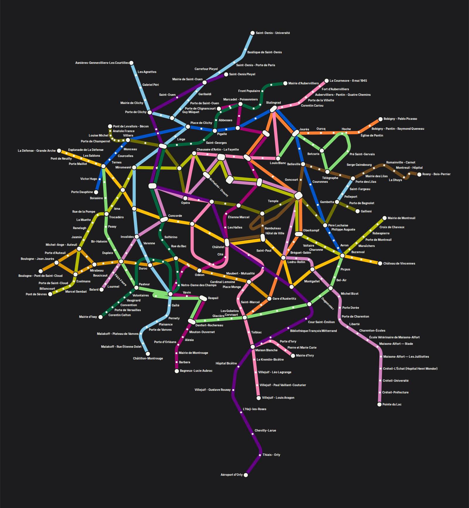 | 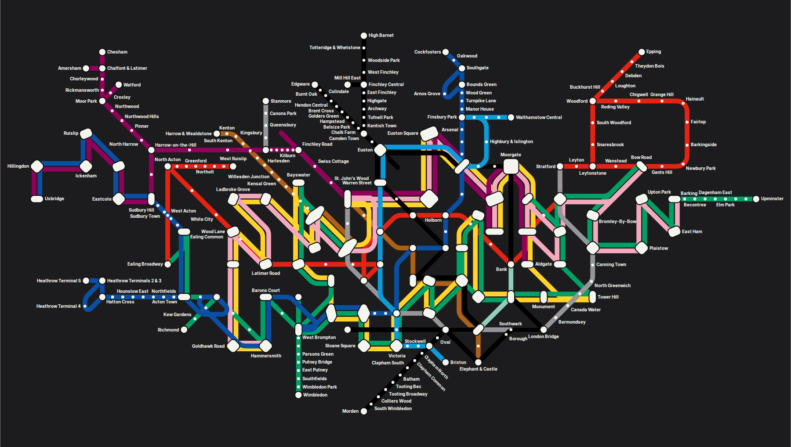 |

| Philadelphia (SEPTA + PATCO) | Pittsburgh (PRT light rail) |
|---|---|
| 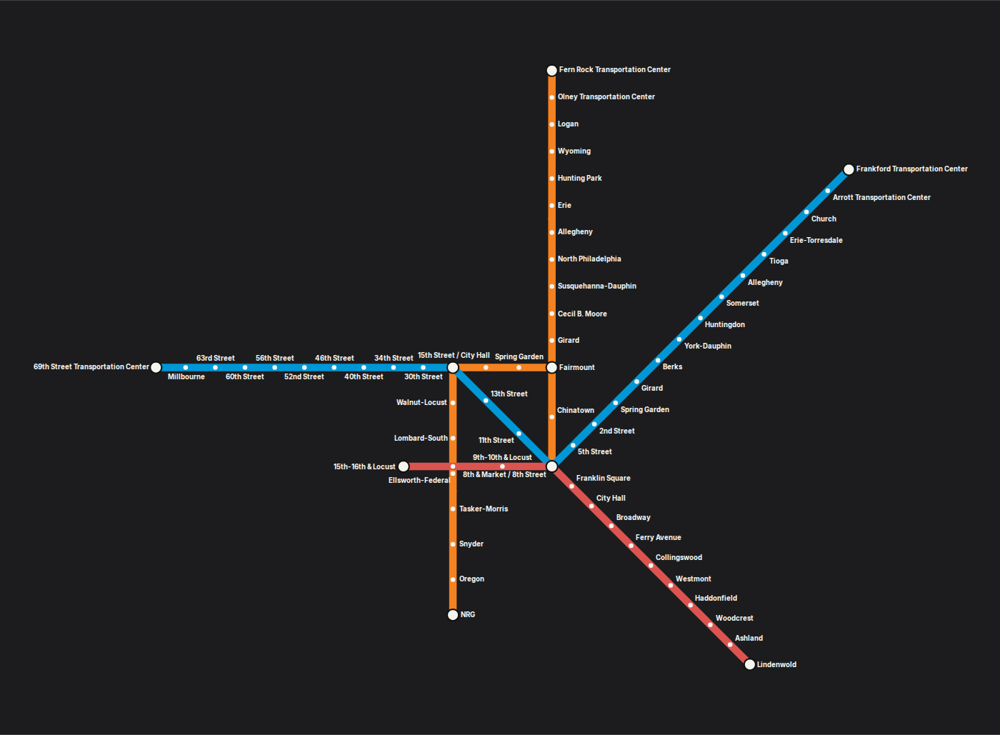 | 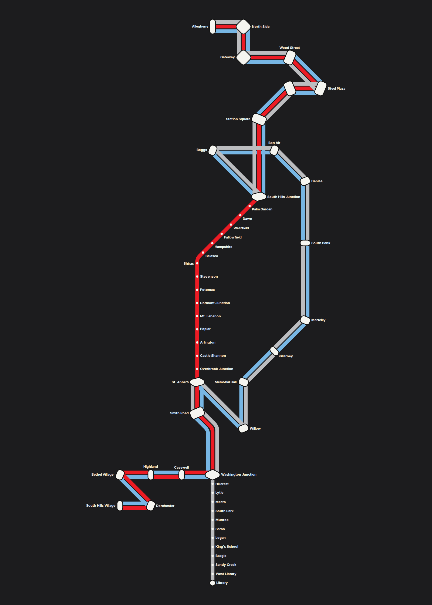 |

| Front view | Print bed close-up |
|---|---|
| 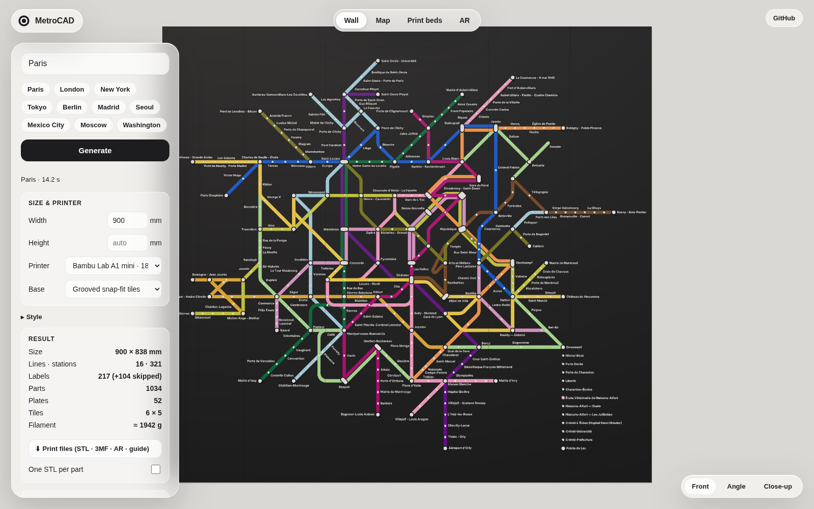 |  |

## License

MIT. Inter font © Rasmus Andersson, SIL Open Font License.
