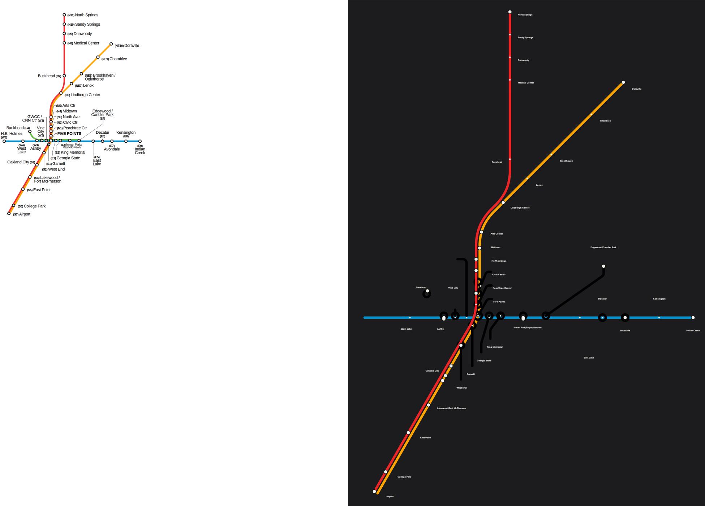

# Atlanta: our layout vs the operator's map

Source drawing: `atlanta-0.svg` · 900 mm wide · 41/43 stations placed on the official geometry · 36 labels placed, 32 moved away from where the drawing has them · 16 geometry problems.

| Line | Stations | On map | Off-line | Jumps | Our colour | Official colour | Missing from map |
|---|---|---|---|---|---|---|---|
| Blue MARTA Blue Line | 15 | 13 | 2 | 0 | #0274ba | #0093d0 | Hamilton E. Holmes, SEC District |
| Gold MARTA Gold Line | 18 | 18 | 6 | 0 | #f67705 | #ffa500 |  |
| Green MARTA Green Line | 10 | 9 | 0 | 0 | #009544 | #000000 | SEC District |
| Red MARTA Red Line | 19 | 19 | 7 | 0 | #cc0000 | #ec2527 |  |

## Problems

* Blue: "Georgia State" sits 70 mm off the Blue line (snapped to the wrong stroke?)
* Blue: "Edgewood/Candler Park" sits 130 mm off the Blue line (snapped to the wrong stroke?)
* Gold: "North Avenue" sits 9 mm off the Gold line (snapped to the wrong stroke?)
* Gold: "Civic Center" sits 9 mm off the Gold line (snapped to the wrong stroke?)
* Gold: "Peachtree Center" sits 9 mm off the Gold line (snapped to the wrong stroke?)
* Gold: "East Point" sits 9 mm off the Gold line (snapped to the wrong stroke?)
* Gold: "College Park" sits 9 mm off the Gold line (snapped to the wrong stroke?)
* Gold: "Airport" sits 9 mm off the Gold line (snapped to the wrong stroke?)
* Red: "Lindbergh Center" sits 10 mm off the Red line (snapped to the wrong stroke?)
* Red: "Arts Center" sits 9 mm off the Red line (snapped to the wrong stroke?)
* Red: "Midtown" sits 9 mm off the Red line (snapped to the wrong stroke?)
* Red: "Garnett" sits 9 mm off the Red line (snapped to the wrong stroke?)
* Red: "West End" sits 9 mm off the Red line (snapped to the wrong stroke?)
* Red: "Oakland City" sits 9 mm off the Red line (snapped to the wrong stroke?)
* Red: "Lakewood/Fort McPherson" sits 9 mm off the Red line (snapped to the wrong stroke?)
* Green: "Five Points" is placed but no line piece passes through it (floating dot)

## Import log

* line Blue: #0093d0 (55% of 13 stations)
* line Gold: #ffa500 (88% of 18 stations)
* line Green: #000000 (38% of 9 stations)
* line Red: #ec2527 (84% of 19 stations)
* SVG import: "Vine City" is drawn as 2 separate stations (81 mm apart); split
* SVG import: "Five Points" is drawn as 4 separate stations (58 mm apart); split
* SVG import: "King Memorial" is drawn as 2 separate stations (77 mm apart); split
* SVG import: 41/43 stations matched, 4 line colours
