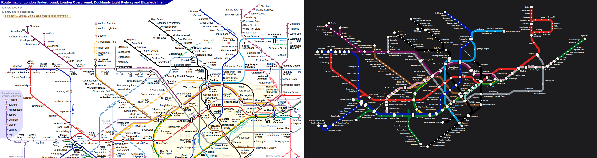

# London: our layout vs the operator's map

Source drawing: `london.svg` · 900 mm wide · 267/267 stations placed on the official geometry · 242 labels placed, 4 moved away from where the drawing has them · 9 geometry problems.

| Line | Stations | On map | Off-line | Jumps | Our colour | Official colour | Missing from map |
|---|---|---|---|---|---|---|---|
| Bakerloo Bakerloo line | 25 | 25 | 1 | 0 | #ae6017 | #894e24 |  |
| Central Central line | 49 | 49 | 0 | 0 | #e42313 | #dc241f |  |
| Circle Circle line | 35 | 35 | 1 | 0 | #ffd329 | #ffce00 |  |
| District District line | 60 | 60 | 1 | 0 | #00a166 | #007229 |  |
| Hammersmith & City Hammersmith & City line | 29 | 29 | 2 | 0 | #f4a9be | #d799af |  |
| Jubilee Jubilee line | 27 | 27 | 0 | 0 | #949699 | #868f98 |  |
| Metropolitan Metropolitan line | 34 | 34 | 0 | 0 | #91005a | #751056 |  |
| Northern Northern line | 52 | 52 | 1 | 0 | #000000 | #000000 |  |
| Piccadilly Piccadilly line | 51 | 51 | 1 | 0 | #094fa3 | #0019a8 |  |
| Victoria Victoria line | 16 | 16 | 0 | 0 | #0a9cda | #00a0e2 |  |
| Waterloo & City Waterloo & City line | 2 | 2 | 0 | 0 | #93ceba | #76d0bd |  |

## Problems

* Bakerloo: "Paddington" sits 19 mm off the Bakerloo line (snapped to the wrong stroke?)
* Circle: "Liverpool Street" sits 9 mm off the Circle line (snapped to the wrong stroke?)
* District: "Hammersmith" sits 23 mm off the District line (snapped to the wrong stroke?)
* Hammersmith & City: "Paddington" sits 23 mm off the Hammersmith & City line (snapped to the wrong stroke?)
* Hammersmith & City: "Liverpool Street" sits 11 mm off the Hammersmith & City line (snapped to the wrong stroke?)
* Northern: "Moorgate" sits 28 mm off the Northern line (snapped to the wrong stroke?)
* Piccadilly: "Hammersmith" sits 18 mm off the Piccadilly line (snapped to the wrong stroke?)
* Circle/Hammersmith & City: "Goldhawk Road" is placed but no line piece passes through it (floating dot)
* Circle/Metropolitan/Hammersmith & City: "Euston Square" is placed but no line piece passes through it (floating dot)

## Import log

* line Bakerloo: #894e24 (73% of 25 stations)
* line Central: #dc241f (91% of 49 stations)
* line Circle: #ffce00 (74% of 35 stations)
* line District: #007229 (54% of 60 stations)
* line Hammersmith & City: #d799af (77% of 29 stations)
* line Jubilee: #868f98 (90% of 27 stations)
* line Metropolitan: #751056 (80% of 34 stations)
* line Northern: #000000 (100% of 52 stations)
* line Piccadilly: #0019a8 (66% of 51 stations)
* line Victoria: #00a0e2 (91% of 16 stations)
* line Waterloo & City: #76d0bd (82% of 2 stations)
* SVG import: "moorgate" and "farringdon" landed on the same point
* SVG import: "hammersmith" and "goldhawk-road" landed on the same point
* SVG import: "paddington" and "bayswater" landed on the same point
* SVG import: "monument" and "mansion-house" landed on the same point
* SVG import: "high-street-kensington" and "kensington-olympia" landed on the same point
* SVG import: 267/267 stations matched, 11 line colours
