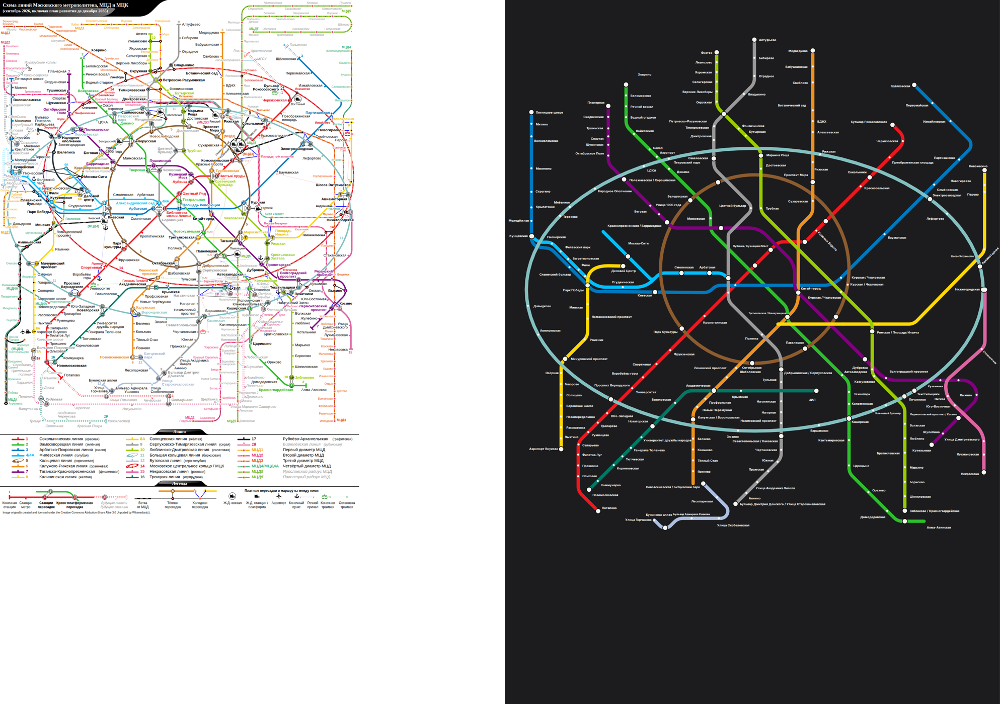

# Moscow: our layout vs the operator's map

Source drawing: `moscow.svg` · 900 mm wide · 220/220 stations placed on the official geometry · 207 labels placed, 56 moved away from where the drawing has them · 46 geometry problems.

| Line | Stations | On map | Off-line | Jumps | Our colour | Official colour | Missing from map |
|---|---|---|---|---|---|---|---|
| 1 Сокольническая линия | 27 | 27 | 3 | 0 | #e4002b | #ef161e |  |
| 2 Замоскворецкая линия | 24 | 24 | 5 | 0 | #006400 | #2dbe2c |  |
| 3 Арбатско-Покровская линия | 22 | 22 | 4 | 0 | #0072bc | #0078be |  |
| 4 Филёвская линия | 13 | 13 | 2 | 0 | #33ccff | #00bfff |  |
| 5 Кольцевая линия | 12 | 12 | 5 | 0 | #802f08 | #8d5b2d |  |
| 6 Калужско-Рижская линия | 24 | 24 | 3 | 0 | #f7941d | #ed9121 |  |
| 7 Таганско-Краснопресненская линия | 23 | 23 | 3 | 0 | #ff00ff | #800080 |  |
| 8 Калининская линия | 8 | 8 | 4 | 0 | #ffff00 | #ffd702 |  |
| 8А Солнцевская линия | 14 | 14 | 0 | 0 | #ffff00 | #ffd702 |  |
| 9 Серпуховско-Тимирязевская линия | 25 | 25 | 2 | 0 | #a0a2a3 | #999999 |  |
| 10 Люблинско-Дмитровская линия | 26 | 26 | 3 | 0 | #b4d445 | #99cc00 |  |
| 11 Большая кольцевая линия | 29 | 29 | 9 | 0 | #82c0c0 | #82c0c0 |  |
| 12 Бутовская линия | 7 | 7 | 1 | 0 | #bac8e8 | #acbfe1 |  |
| 15 Некрасовская линия | 8 | 8 | 1 | 0 | #de64a1 | #de64a1 |  |
| 16 Троицкая линия | 11 | 11 | 0 | 0 | #03795f | #017864 |  |

## Problems

* 1: "Парк Культуры" sits 13 mm off the 1 line (snapped to the wrong stroke?)
* 1: "Проспект Вернадского" sits 13 mm off the 1 line (snapped to the wrong stroke?)
* 1: "Новомосковская" sits 16 mm off the 1 line (snapped to the wrong stroke?)
* 2: "Зябликово / Красногвардейская" sits 19 mm off the 2 line (snapped to the wrong stroke?)
* 2: "Павелецкая" sits 13 mm off the 2 line (snapped to the wrong stroke?)
* 2: "Площадь Революции / Охотный Ряд / Театральная" sits 13 mm off the 2 line (snapped to the wrong stroke?)
* 2: "Чеховская / Пушкинская / Тверская" sits 17 mm off the 2 line (snapped to the wrong stroke?)
* 2: "Белорусская" sits 13 mm off the 2 line (snapped to the wrong stroke?)
* 3: "Электрозаводская" sits 13 mm off the 3 line (snapped to the wrong stroke?)
* 3: "Площадь Революции / Охотный Ряд / Театральная" sits 36 mm off the 3 line (snapped to the wrong stroke?)
* 3: "Арбатская" sits 27 mm off the 3 line (snapped to the wrong stroke?)
* 3: "Смоленская" sits 35 mm off the 3 line (snapped to the wrong stroke?)
* 4: "Киевская" sits 19 mm off the 4 line (snapped to the wrong stroke?)
* 4: "Деловой Центр" sits 19 mm off the 4 line (snapped to the wrong stroke?)
* 5: "Проспект Мира" sits 19 mm off the 5 line (snapped to the wrong stroke?)
* 5: "Комсомольская" sits 16 mm off the 5 line (snapped to the wrong stroke?)
* 5: "Добрынинская / Серпуховская" sits 17 mm off the 5 line (snapped to the wrong stroke?)
* 5: "Киевская" sits 15 mm off the 5 line (snapped to the wrong stroke?)
* 5: "Краснопресненская / Баррикадная" sits 9 mm off the 5 line (snapped to the wrong stroke?)
* 6: "Тургеневская / Чистые пруды / Сретенский бульвар" sits 12 mm off the 6 line (snapped to the wrong stroke?)
* 6: "Октябрьская" sits 14 mm off the 6 line (snapped to the wrong stroke?)
* 6: "Новоясеневская / Битцевский парк" sits 18 mm off the 6 line (snapped to the wrong stroke?)
* 7: "Лубянка / Кузнецкий Мост" sits 13 mm off the 7 line (snapped to the wrong stroke?)
* 7: "Таганская / Марксистская" sits 17 mm off the 7 line (snapped to the wrong stroke?)
* 7: "Текстильщики" sits 19 mm off the 7 line (snapped to the wrong stroke?)
* 8: "Третьяковская / Новокузнецкая" sits 13 mm off the 8 line (snapped to the wrong stroke?)
* 8: "Таганская / Марксистская" sits 13 mm off the 8 line (snapped to the wrong stroke?)
* 8: "Римская / Площадь Ильича" sits 13 mm off the 8 line (snapped to the wrong stroke?)
* 8: "Авиамоторная" sits 13 mm off the 8 line (snapped to the wrong stroke?)
* 9: "Новослободская / Менделеевская" sits 13 mm off the 9 line (snapped to the wrong stroke?)
* 9: "Чеховская / Пушкинская / Тверская" sits 17 mm off the 9 line (snapped to the wrong stroke?)
* 10: "Тургеневская / Чистые пруды / Сретенский бульвар" sits 18 mm off the 10 line (snapped to the wrong stroke?)
* 10: "Пролетарская / Крестьянская Застава" sits 13 mm off the 10 line (snapped to the wrong stroke?)
* 10: "Печатники" sits 13 mm off the 10 line (snapped to the wrong stroke?)
* 11: "Сокольники" sits 17 mm off the 11 line (snapped to the wrong stroke?)
* 11: "Севастопольская / Каховская" sits 11 mm off the 11 line (snapped to the wrong stroke?)
* 11: "Калужская / Воронцовская" sits 11 mm off the 11 line (snapped to the wrong stroke?)
* 11: "Новаторская" sits 18 mm off the 11 line (snapped to the wrong stroke?)
* 11: "Мичуринский проспект" sits 12 mm off the 11 line (snapped to the wrong stroke?)
* 11: "Кунцевская" sits 18 mm off the 11 line (snapped to the wrong stroke?)
* 11: "Полежаевская / Хорошёвская" sits 9 mm off the 11 line (snapped to the wrong stroke?)
* 11: "Савёловская" sits 14 mm off the 11 line (snapped to the wrong stroke?)
* 11: "Марьина Роща" sits 13 mm off the 11 line (snapped to the wrong stroke?)
* 12: "Бульвар Дмитрия Донского / Улица Старокачаловская" sits 17 mm off the 12 line (snapped to the wrong stroke?)
* 15: "Лермонтовский проспект / Косино" sits 12 mm off the 15 line (snapped to the wrong stroke?)
* 12: "Улица Горчакова" is placed but no line piece passes through it (floating dot)

## Import log

* line 1: #ef161e (93% of 27 stations)
* line 2: #2dbe2c (68% of 24 stations)
* line 3: #0078be (98% of 22 stations)
* line 4: #00bfff (73% of 13 stations)
* line 5: #8d5b2d (85% of 12 stations)
* line 6: #ed9121 (97% of 24 stations)
* line 7: #800080 (51% of 23 stations)
* line 8: #ffd702 (90% of 8 stations)
* line 8А: #ffd702 (90% of 14 stations)
* line 9: #999999 (92% of 25 stations)
* line 10: #99cc00 (71% of 26 stations)
* line 11: #82c0c0 (100% of 29 stations)
* line 12: #acbfe1 (95% of 7 stations)
* line 15: #de64a1 (100% of 8 stations)
* line 16: #017864 (99% of 11 stations)
* SVG import: "Курская / Чкаловская" is drawn as 3 separate stations (49 mm apart); split
* SVG import: "Рижская" is drawn as 2 separate stations (57 mm apart); split
* SVG import: "Боровицкая / Александровский сад / Библиотека имени Ленина" is drawn as 3 separate stations (50 mm apart); split
* SVG import: 220/220 stations matched, 14 line colours
