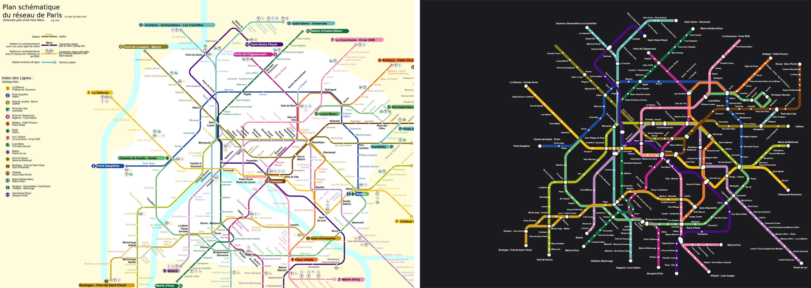

# Paris: our layout vs the operator's map

Source drawing: `paris.svg` · 900 mm wide · 308/321 stations placed on the official geometry · 272 labels placed, 39 moved away from where the drawing has them · 26 geometry problems.

| Line | Stations | On map | Off-line | Jumps | Our colour | Official colour | Missing from map |
|---|---|---|---|---|---|---|---|
| 1 Ligne 1 : La Défense (Grande Arche) ↔ Château de Vincennes | 25 | 25 | 2 | 0 | #ffbe00 | #f7bf0f |  |
| 2 Ligne 2 : Porte Dauphine ↔ Nation | 25 | 25 | 2 | 0 | #0055c8 | #1c4b9c |  |
| 3 Ligne 3 : Pont de Levallois ↔ Gallieni | 25 | 24 | 3 | 0 | #6e6e00 | #8a7817 | Pont de Levallois - Bécon |
| 3bis Ligne 3bis : Gambetta ↔ Porte des Lilas | 4 | 4 | 0 | 0 | #82c8e6 | #6cbcb8 |  |
| 4 Ligne 4 : Porte de Clignancourt ↔ Bagneux - Lucie Aubrac | 29 | 27 | 1 | 0 | #a0006e | #b82788 | Marcadet - Poissonniers, Strasbourg - Saint-Denis |
| 5 Ligne 5 : Bobigny - Pablo Picasso ↔ Place d’Italie | 22 | 22 | 2 | 0 | #ff7f32 | #f57928 |  |
| 6 Ligne 6 : Charles de Gaulle - Étoile ↔ Nation | 28 | 27 | 1 | 0 | #82dc73 | #6db76e | La Motte-Picquet - Grenelle |
| 7 Ligne 7: La Courneuve ↔ Villejuif - Louis Aragon / Mairie d’Ivry | 38 | 34 | 1 | 0 | #ff82b4 | #f088af | Porte de la Villette, Poissonnière, Chaussée d'Antin - La Fayette, Pierre et Marie Curie |
| 7bis Ligne 7 bis : Louis Blanc ↔ Pré Saint-Gervais | 8 | 8 | 0 | 0 | #82dc73 | #6db76e |  |
| 8 Ligne 8 : Balard ↔ Pointe du Lac | 38 | 33 | 2 | 0 | #d282be | #b88bbf | Faidherbe — Chaligny, Ledru-Rollin, Saint-Sébastien - Froissart, Strasbourg - Saint-Denis, La Motte-Picquet - Grenelle |
| 9 Ligne 9 : Pont de Sèvres ↔ Mairie de Montreuil | 37 | 35 | 1 | 0 | #b6bd00 | #aab91b | Chaussée d'Antin - La Fayette, Strasbourg - Saint-Denis |
| 10 Ligne 10 : Pont de Saint-Cloud ↔ Gare d’Austerlitz | 23 | 22 | 0 | 0 | #dc9600 | #d1a01c | La Motte-Picquet - Grenelle |
| 11 Ligne 11 : Châtelet ↔ Rosny - Bois-Perrier | 19 | 19 | 2 | 0 | #6e491e | #753d0d |  |
| 12 Ligne 12 : Mairie d'Aubervilliers ↔ Mairie d’Issy | 31 | 30 | 2 | 0 | #00643c | #0f6b3c | Marcadet - Poissonniers |
| 13 Ligne 13 : Les Courtilles / Saint-Denis - Université ↔ Châtillon - Montrouge | 32 | 32 | 3 | 0 | #82c8e6 | #6cbcb8 |  |
| 14 Ligne 14 : Saint-Denis – Pleyel ↔ Aéroport d’Orly | 21 | 19 | 1 | 0 | #640082 | #450d7a | Bibliothèque François Mitterrand, Villejuif - Gustave Roussy |

## Problems

* 1: "Palais Royal - Musée du Louvre" sits 16 mm off the 1 line (snapped to the wrong stroke?)
* 1: "Charles de Gaulle - Étoile" sits 75 mm off the 1 line (snapped to the wrong stroke?)
* 2: "Stalingrad" sits 35 mm off the 2 line (snapped to the wrong stroke?)
* 2: "Barbès - Rochechouart" sits 43 mm off the 2 line (snapped to the wrong stroke?)
* 3: "Havre - Caumartin" sits 13 mm off the 3 line (snapped to the wrong stroke?)
* 3: "Opéra" sits 21 mm off the 3 line (snapped to the wrong stroke?)
* 3: "République" sits 41 mm off the 3 line (snapped to the wrong stroke?)
* 4: "Odéon" sits 27 mm off the 4 line (snapped to the wrong stroke?)
* 5: "Stalingrad" sits 32 mm off the 5 line (snapped to the wrong stroke?)
* 5: "République" sits 11 mm off the 5 line (snapped to the wrong stroke?)
* 6: "Charles de Gaulle - Étoile" sits 64 mm off the 6 line (snapped to the wrong stroke?)
* 7: "Gare de L'Est" sits 33 mm off the 7 line (snapped to the wrong stroke?)
* 8: "Opéra" sits 24 mm off the 8 line (snapped to the wrong stroke?)
* 8: "Madeleine" sits 26 mm off the 8 line (snapped to the wrong stroke?)
* 9: "République" sits 33 mm off the 9 line (snapped to the wrong stroke?)
* 11: "République" sits 37 mm off the 11 line (snapped to the wrong stroke?)
* 11: "Place des Fêtes" sits 28 mm off the 11 line (snapped to the wrong stroke?)
* 12: "Saint-Lazare" sits 103 mm off the 12 line (snapped to the wrong stroke?)
* 12: "Montparnasse-Bienvenüe" sits 36 mm off the 12 line (snapped to the wrong stroke?)
* 13: "Mairie de Saint-Ouen" sits 20 mm off the 13 line (snapped to the wrong stroke?)
* 13: "Saint-Lazare" sits 76 mm off the 13 line (snapped to the wrong stroke?)
* 13: "Montparnasse-Bienvenüe" sits 29 mm off the 13 line (snapped to the wrong stroke?)
* 14: "Saint-Lazare" sits 31 mm off the 14 line (snapped to the wrong stroke?)
* 7: "Château Landon" is placed but no line piece passes through it (floating dot)
* 14/13: "Mairie de Saint-Ouen" is placed but no line piece passes through it (floating dot)
* 2: "Porte Dauphine" is placed but no line piece passes through it (floating dot)

## Import log

* line 1: #f7bf0f (71% of 25 stations)
* line 2: #1c4b9c (62% of 25 stations)
* line 3: #8a7817 (70% of 24 stations)
* line 3bis: #6cbcb8 (51% of 4 stations)
* line 4: #b82788 (60% of 27 stations)
* line 5: #f57928 (74% of 22 stations)
* line 6: #6db76e (65% of 27 stations)
* line 7: #f088af (76% of 34 stations)
* line 7bis: #6db76e (64% of 8 stations)
* line 8: #b88bbf (78% of 33 stations)
* line 9: #aab91b (77% of 35 stations)
* line 10: #d1a01c (76% of 22 stations)
* line 11: #753d0d (82% of 19 stations)
* line 12: #0f6b3c (77% of 30 stations)
* line 13: #6cbcb8 (64% of 32 stations)
* line 14: #450d7a (62% of 19 stations)
* SVG import: "stalingrad" and "louis-blanc" landed on the same point
* SVG import: "stalingrad" and "chateau-landon" landed on the same point
* SVG import: "louis-blanc" and "chateau-landon" landed on the same point
* SVG import: "pyramides" and "palais-royal-musee-du-louvre" landed on the same point
* SVG import: "saint-denis-pleyel" and "mairie-de-saint-ouen" landed on the same point
* SVG import: "saint-lazare" and "pereire" landed on the same point
* SVG import: "montparnasse-bienvenue" and "raspail" landed on the same point
* SVG import: "charles-de-gaulle-etoile" and "porte-dauphine" landed on the same point
* SVG import: "place-des-fetes" and "pre-saint-gervais" landed on the same point
* SVG import: 308/321 stations matched, 14 line colours
