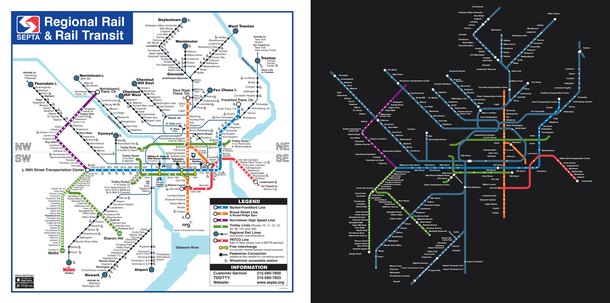

# Philadelphia: our layout vs the operator's map

Source drawing: `philadelphia.svg` · 900 mm wide · 281/524 stations placed on the official geometry · 277 labels placed, 73 moved away from where the drawing has them · 10 geometry problems.

| Line | Stations | On map | Off-line | Jumps | Our colour | Official colour | Missing from map |
|---|---|---|---|---|---|---|---|
| B SEPTA Broad Street Line | 24 | 22 | 1 | 0 | #f58220 | #f37324 | NRG, 8th & Market |
| D D (D1–D2) | 50 | 46 | 0 | 0 | #dc2e6b | #5e9732 | Edgemont Street, Springfield Road, Anderson Avenue, 69th Street Transportation Center West Terminal |
| G SEPTA 15 | 51 | 0 | 0 | 0 | #ffd700 | — | Girard Avenue & 63rd Street, Girard Avenue & 62nd Street, Girard Avenue & 61st Street, Girard Avenue & 60th Street, Girard Avenue & 59th Street, Girard Avenue & 57th Street, Girard Avenue & 56th Street, Girard Avenue & 54th Street … (+43) |
| L SEPTA Market-Frankford Line | 28 | 27 | 2 | 0 | #0097d6 | #007dc3 | 69th Street Transportation Center |
| M SEPTA Norristown High Speed Line | 22 | 21 | 2 | 0 | #5f249f | #781d7d | 69th Street Transportation Center |
| PATCO PATCO Speedline | 14 | 10 | 0 | 0 | #db5450 | #ef3d42 | 15th-16th & Locust, 12th-13th & Locust, 9th-10th & Locust, 8th & Market |
| T T (T1–T4) | 190 | 11 | 2 | 0 | #6ea516 | #5e9732 | Malvern Avenue & 63rd Street, 63rd Street & Lebanon Avenue, 63rd Street & Jefferson Street, 63rd Street & Lansdowne Avenue, Lansdowne Avenue & 62nd Street, Lansdowne Avenue & 61st Street, Lansdowne Avenue & 60th Street, Lansdowne Avenue & 59th Street … (+171) |
| AIR Airport Line | 10 | 9 | 0 | 0 | #4c748c | #3a6e8f | Temple University |
| CHE Chestnut Hill East Line | 14 | 13 | 0 | 0 | #4c748c | #3a6e8f | Temple University |
| CHW Chestnut Hill West Line | 14 | 12 | 0 | 0 | #4c748c | #3a6e8f | Allen Lane, Temple University |
| CYN Cynwyd Line | 6 | 6 | 0 | 0 | #4c748c | #3a6e8f |  |
| FOX Fox Chase Line | 10 | 9 | 0 | 0 | #4c748c | #3a6e8f | Temple University |
| LAN Lansdale/Doylestown Line | 26 | 25 | 0 | 0 | #4c748c | #3a6e8f | Temple University |
| MED Media/Wawa Line | 20 | 18 | 0 | 0 | #4c748c | #3a6e8f | Wawa, Temple University |
| NOR Manayunk/Norristown Line | 16 | 15 | 0 | 0 | #4c748c | #3a6e8f | Temple University |
| PAO Paoli/Thorndale Line | 26 | 25 | 0 | 0 | #4c748c | #3a6e8f | Temple University |
| TRE Trenton Line | 15 | 14 | 0 | 0 | #4c748c | #3a6e8f | Temple University |
| WAR Warminster Line | 16 | 15 | 0 | 0 | #4c748c | #3a6e8f | Temple University |
| WTR West Trenton Line | 22 | 21 | 0 | 0 | #4c748c | #3a6e8f | Temple University |
| WIL Wilmington/Newark Line | 22 | 21 | 0 | 0 | #4c748c | #3a6e8f | Temple University |

## Problems

* B: "Fern Rock Transportation Center" sits 17 mm off the B line (snapped to the wrong stroke?)
* L: "13th Street" sits 14 mm off the L line (snapped to the wrong stroke?)
* L: "30th Street" sits 21 mm off the L line (snapped to the wrong stroke?)
* M: "Norristown Transportation Center" sits 21 mm off the M line (snapped to the wrong stroke?)
* M: "Villanova" sits 11 mm off the M line (snapped to the wrong stroke?)
* T: "30th Street" sits 35 mm off the T line (snapped to the wrong stroke?)
* T: "15th Street" sits 14 mm off the T line (snapped to the wrong stroke?)
* PATCO: "City Hall" is placed but no line piece passes through it (floating dot)
* WTR: "Neshaminy Falls" is placed but no line piece passes through it (floating dot)
* D: "MacDade Boulevard" is placed but no line piece passes through it (floating dot)

## Import log

* line B: #f37324 (29% of 23 stations)
* line D: #5e9732 (20% of 49 stations)
* line G: #ef3d42 (0% of 0 stations)
* line L: #007dc3 (59% of 28 stations)
* line M: #781d7d (28% of 22 stations)
* line PATCO: #ef3d42 (75% of 11 stations)
* line T: #5e9732 (41% of 22 stations)
* line AIR: #3a6e8f (57% of 10 stations)
* line CHE: #3a6e8f (88% of 14 stations)
* line CHW: #3a6e8f (81% of 14 stations)
* line CYN: #3a6e8f (79% of 6 stations)
* line FOX: #3a6e8f (76% of 10 stations)
* line LAN: #3a6e8f (26% of 26 stations)
* line MED: #3a6e8f (80% of 19 stations)
* line NOR: #3a6e8f (83% of 16 stations)
* line PAO: #3a6e8f (55% of 26 stations)
* line TRE: #3a6e8f (57% of 15 stations)
* line WAR: #3a6e8f (71% of 16 stations)
* line WTR: #3a6e8f (65% of 22 stations)
* line WIL: #3a6e8f (26% of 22 stations)
* SVG import: "North Philadelphia" is drawn as 2 separate stations (73 mm apart); split
* SVG import: "Radnor" is drawn as 2 separate stations (58 mm apart); split
* SVG import: "Clifton-Aldan" is drawn as 2 separate stations (67 mm apart); split
* SVG import: "Sharon Hill" is drawn as 2 separate stations (67 mm apart); split
* SVG import: 281/524 stations matched, 6 line colours
