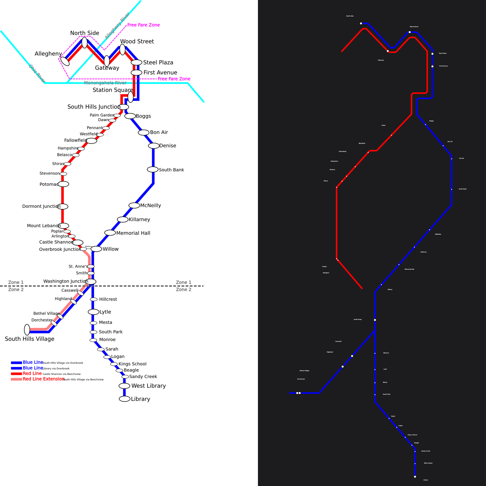

# Pittsburgh: our layout vs the operator's map

Source drawing: `pittsburgh.svg` · 900 mm wide · 37/51 stations placed on the official geometry · 37 labels placed, 31 moved away from where the drawing has them · 21 geometry problems.

| Line | Stations | On map | Off-line | Jumps | Our colour | Official colour | Missing from map |
|---|---|---|---|---|---|---|---|
| Blue PRT Blue Line | 24 | 18 | 1 | 0 | #77b6e4 | #0000ff | South Hills Village, Washington Junction, St. Anne's, South Hills Junction, Station Square, Allegheny |
| Red PRT Red Line | 31 | 18 | 9 | 10 | #ec1b24 | #ff0000 | Overbrook Junction, Castle Shannon, Mt. Lebanon, Dormont Junction, Potomac, Stevenson, Palm Garden, South Hills Junction … (+5) |
| Silver PRT Silver Line | 31 | 25 | 1 | 0 | #bcbdc0 | #0000ff | Munroe, Washington Junction, St. Anne's, South Hills Junction, Station Square, Allegheny |

## Problems

* Blue: "Gateway" sits 17 mm off the Blue line (snapped to the wrong stroke?)
* Red: "First Avenue" sits 21 mm off the Red line (snapped to the wrong stroke?)
* Red: "Steel Plaza" sits 21 mm off the Red line (snapped to the wrong stroke?)
* Red: "Wood Street" sits 21 mm off the Red line (snapped to the wrong stroke?)
* Red: "North Side" sits 23 mm off the Red line (snapped to the wrong stroke?)
* Red: "Smith Road" sits 135 mm off the Red line (snapped to the wrong stroke?)
* Red: "Casswell" sits 269 mm off the Red line (snapped to the wrong stroke?)
* Red: "Highland" sits 318 mm off the Red line (snapped to the wrong stroke?)
* Red: "Bethel Village" sits 480 mm off the Red line (snapped to the wrong stroke?)
* Red: "Dorchester" sits 485 mm off the Red line (snapped to the wrong stroke?)
* Red: Poplar → Shiras is 282 mm apart (a station out of place, or a gap in the traced line)
* Red: Dawn → First Avenue is 316 mm apart (a station out of place, or a gap in the traced line)
* Red: First Avenue → Dawn is 316 mm apart (a station out of place, or a gap in the traced line)
* Red: Shiras → Poplar is 282 mm apart (a station out of place, or a gap in the traced line)
* Red: First Avenue → Dawn is 316 mm apart (a station out of place, or a gap in the traced line)
* Red: Shiras → Poplar is 282 mm apart (a station out of place, or a gap in the traced line)
* Red: Arlington → Smith Road is 277 mm apart (a station out of place, or a gap in the traced line)
* Red: Smith Road → Arlington is 277 mm apart (a station out of place, or a gap in the traced line)
* Red: Poplar → Shiras is 282 mm apart (a station out of place, or a gap in the traced line)
* Red: Dawn → First Avenue is 316 mm apart (a station out of place, or a gap in the traced line)
* Silver: "Gateway" sits 17 mm off the Silver line (snapped to the wrong stroke?)

## Import log

* line Blue: #0000ff (21% of 24 stations)
* line Red: #ff0000 (17% of 31 stations)
* line Silver: #0000ff (29% of 30 stations)
* SVG import: 37/51 stations matched, 2 line colours
