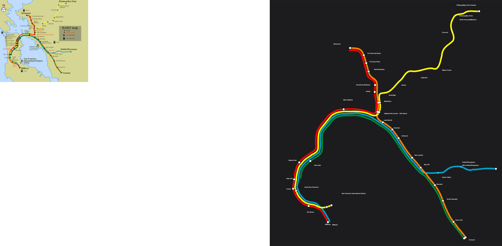

# San-francisco: our layout vs the operator's map

Source drawing: `san-francisco-0.svg` · 900 mm wide · 38/49 stations placed on the official geometry · 38 labels placed, 22 moved away from where the drawing has them · 17 geometry problems.

| Line | Stations | On map | Off-line | Jumps | Our colour | Official colour | Missing from map |
|---|---|---|---|---|---|---|---|
| Blue Dublin/Pleasanton–Daly City Line | 18 | 12 | 3 | 0 | #00aeef | #00a0c6 | Embarcadero, Montgomery Street, Powell Street, Civic Center, 16th Street Mission, 24th Street Mission |
| Green Berryessa/North San José–Daly City Line | 22 | 13 | 8 | 0 | #4db848 | #008737 | Berryessa/North San José, Milpitas, Warm Springs/South Fremont, Embarcadero, Montgomery Street, Powell Street, Civic Center, 16th Street Mission … (+1) |
| Orange Berryessa/North San José–Richmond Line | 21 | 17 | 0 | 0 | #faa61a | #ff7f00 | 19th Street Oakland, Warm Springs/South Fremont, Milpitas, Berryessa/North San José |
| Red Richmond–Millbrae+SFO Line | 24 | 17 | 4 | 0 | #ed1c24 | #ff0101 | 19th Street Oakland, Embarcadero, Montgomery Street, Powell Street, Civic Center, 16th Street Mission, 24th Street Mission |
| Yellow Antioch–SFO+Millbrae Line | 27 | 19 | 2 | 0 | #ffe800 | #fff700 | Pleasant Hill/Contra Costa Centre, 19th Street Oakland, Embarcadero, Montgomery Street, Powell Street, Civic Center, 16th Street Mission, 24th Street Mission |

## Problems

* Blue: "West Oakland" sits 18 mm off the Blue line (snapped to the wrong stroke?)
* Blue: "Balboa Park" sits 17 mm off the Blue line (snapped to the wrong stroke?)
* Blue: "Daly City" sits 16 mm off the Blue line (snapped to the wrong stroke?)
* Green: "Bay Fair" sits 15 mm off the Green line (snapped to the wrong stroke?)
* Green: "San Leandro" sits 16 mm off the Green line (snapped to the wrong stroke?)
* Green: "Coliseum" sits 16 mm off the Green line (snapped to the wrong stroke?)
* Green: "Fruitvale" sits 16 mm off the Green line (snapped to the wrong stroke?)
* Green: "Lake Merritt" sits 16 mm off the Green line (snapped to the wrong stroke?)
* Green: "West Oakland" sits 25 mm off the Green line (snapped to the wrong stroke?)
* Green: "Balboa Park" sits 25 mm off the Green line (snapped to the wrong stroke?)
* Green: "Daly City" sits 25 mm off the Green line (snapped to the wrong stroke?)
* Red: "MacArthur" sits 11 mm off the Red line (snapped to the wrong stroke?)
* Red: "Oakland City Center - 12th Street" sits 10 mm off the Red line (snapped to the wrong stroke?)
* Red: "Glen Park" sits 25 mm off the Red line (snapped to the wrong stroke?)
* Red: "San Francisco International Airport" sits 45 mm off the Red line (snapped to the wrong stroke?)
* Yellow: "Glen Park" sits 17 mm off the Yellow line (snapped to the wrong stroke?)
* Yellow: "Balboa Park" sits 9 mm off the Yellow line (snapped to the wrong stroke?)

## Import log

* line Blue: #00a0c6 (61% of 16 stations)
* line Green: #008737 (53% of 17 stations)
* line Orange: #ff7f00 (83% of 17 stations)
* line Red: #ff0101 (58% of 21 stations)
* line Yellow: #fff700 (71% of 23 stations)
* SVG import: "Millbrae" is drawn as 2 separate stations (59 mm apart); split
* SVG import: 38/49 stations matched, 5 line colours
