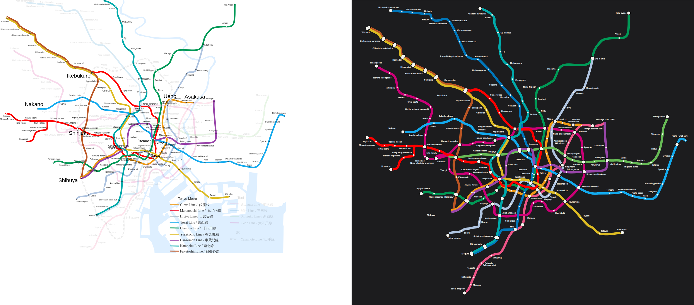

# Tokyo: our layout vs the operator's map

Source drawing: `tokyo-0.svg` · 900 mm wide · 215/221 stations placed on the official geometry · 167 labels placed, 22 moved away from where the drawing has them · 27 geometry problems.

| Line | Stations | On map | Off-line | Jumps | Our colour | Official colour | Missing from map |
|---|---|---|---|---|---|---|---|
| A 都営浅草線 | 20 | 20 | 2 | 0 | #e85298 | #ee5588 |  |
| C 東京メトロ千代田線 | 20 | 20 | 1 | 0 | #00bb85 | #009956 |  |
| E 都営大江戸線 | 38 | 37 | 1 | 0 | #b6007a | #cc0077 | 新宿西口 |
| F Tokyo Metro Fukutoshin Line | 16 | 16 | 0 | 0 | #9c5e31 | #bc5624 |  |
| G 東京メトロ銀座線 | 19 | 18 | 6 | 0 | #ff9500 | #ee9914 | 外苑前 |
| H 東京メトロ日比谷線 | 22 | 21 | 2 | 0 | #b5b5ac | #afc4e0 | 小伝馬町 |
| I 都営三田線 | 27 | 26 | 2 | 0 | #0079c2 | #0077bb | 新高島平 |
| M 東京メトロ 丸ノ内線 | 28 | 28 | 4 | 0 | #f62e36 | #ff0000 |  |
| N 東京メトロ南北線 | 19 | 19 | 3 | 0 | #00ac9b | #00aaab |  |
| S 都営新宿線 | 21 | 20 | 0 | 0 | #6cbb5a | #67bb56 | 新線新宿 |
| T 東京メトロ東西線 | 23 | 22 | 2 | 0 | #009bbf | #13aaee | 木場 |
| Y 東京メトロ有楽町線 | 24 | 24 | 1 | 0 | #c1a470 | #ddbb23 |  |
| Z 東京メトロ半蔵門線 | 14 | 14 | 2 | 0 | #8f76d6 | #9945aa |  |

## Problems

* A: "新橋" sits 12 mm off the A line (snapped to the wrong stroke?)
* A: "浅草" sits 15 mm off the A line (snapped to the wrong stroke?)
* C: "霞ケ関" sits 18 mm off the C line (snapped to the wrong stroke?)
* E: "大門" sits 25 mm off the E line (snapped to the wrong stroke?)
* G: "上野広小路 / 上野御徒町" sits 11 mm off the G line (snapped to the wrong stroke?)
* G: "三越前" sits 39 mm off the G line (snapped to the wrong stroke?)
* G: "銀座" sits 24 mm off the G line (snapped to the wrong stroke?)
* G: "溜池山王" sits 27 mm off the G line (snapped to the wrong stroke?)
* G: "赤坂見附" sits 22 mm off the G line (snapped to the wrong stroke?)
* G: "渋谷" sits 28 mm off the G line (snapped to the wrong stroke?)
* H: "霞ケ関" sits 55 mm off the H line (snapped to the wrong stroke?)
* H: "東銀座" sits 27 mm off the H line (snapped to the wrong stroke?)
* I: "神保町" sits 24 mm off the I line (snapped to the wrong stroke?)
* I: "春日" sits 37 mm off the I line (snapped to the wrong stroke?)
* M: "新宿" sits 22 mm off the M line (snapped to the wrong stroke?)
* M: "国会議事堂前" sits 20 mm off the M line (snapped to the wrong stroke?)
* M: "銀座" sits 11 mm off the M line (snapped to the wrong stroke?)
* M: "本郷三丁目" sits 55 mm off the M line (snapped to the wrong stroke?)
* N: "永田町" sits 38 mm off the N line (snapped to the wrong stroke?)
* N: "四ツ谷" sits 31 mm off the N line (snapped to the wrong stroke?)
* N: "後楽園" sits 12 mm off the N line (snapped to the wrong stroke?)
* T: "九段下" sits 18 mm off the T line (snapped to the wrong stroke?)
* T: "日本橋" sits 20 mm off the T line (snapped to the wrong stroke?)
* Y: "永田町" sits 49 mm off the Y line (snapped to the wrong stroke?)
* Z: "渋谷" sits 32 mm off the Z line (snapped to the wrong stroke?)
* Z: "押上〈スカイツリー前〉" sits 32 mm off the Z line (snapped to the wrong stroke?)
* Y/F: "地下鉄成増" is placed but no line piece passes through it (floating dot)

## Import log

* line A: #ee5588 (67% of 20 stations)
* line C: #009956 (64% of 20 stations)
* line E: #cc0077 (69% of 37 stations)
* line F: #bc5624 (23% of 16 stations)
* line G: #ee9914 (72% of 18 stations)
* line H: #afc4e0 (82% of 21 stations)
* line I: #0077bb (64% of 26 stations)
* line M: #ff0000 (55% of 28 stations)
* line N: #00aaab (55% of 19 stations)
* line S: #67bb56 (88% of 20 stations)
* line T: #13aaee (55% of 22 stations)
* line Y: #ddbb23 (42% of 24 stations)
* line Z: #9945aa (41% of 14 stations)
* SVG import: "青山一丁目" is drawn as 3 separate stations (58 mm apart); split
* SVG import: "大手町" is drawn as 5 separate stations (81 mm apart); split
* SVG import: "x-8" and "x-9" landed on the same point
* SVG import: "x-15" and "x-119" landed on the same point
* SVG import: "x-15" and "x-120" landed on the same point
* SVG import: "x-22" and "x-23" landed on the same point
* SVG import: "x-30" and "x-31" landed on the same point
* SVG import: "x-34" and "x-135" landed on the same point
* SVG import: "x-49" and "x-70~3" landed on the same point
* SVG import: "x-53" and "x-54" landed on the same point
* SVG import: "x-69" and "x-116" landed on the same point
* SVG import: "x-72" and "x-79" landed on the same point
* SVG import: "x-72~2" and "x-103" landed on the same point
* SVG import: "x-88" and "x-299" landed on the same point
* SVG import: "x-91" and "x-92" landed on the same point
* SVG import: "x-205" and "x-206" landed on the same point
* SVG import: "x-230" and "x-231" landed on the same point
* SVG import: "x-241" and "x-242" landed on the same point
* SVG import: 215/221 stations matched, 13 line colours
