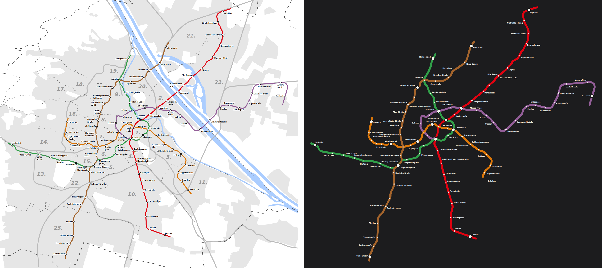

# Vienna: our layout vs the operator's map

Source drawing: `vienna-1.svg` · 900 mm wide · 98/99 stations placed on the official geometry · 90 labels placed, 20 moved away from where the drawing has them · 6 geometry problems.

| Line | Stations | On map | Off-line | Jumps | Our colour | Official colour | Missing from map |
|---|---|---|---|---|---|---|---|
| U1 U1 Oberlaa <=> Leopoldau | 24 | 24 | 2 | 0 | #e3000f | #e20210 |  |
| U2 U2 Seestadt <=> Karlsplatz | 21 | 21 | 2 | 0 | #a862a4 | #935e98 |  |
| U3 U3 Ottakring <=> Simmering | 21 | 20 | 0 | 0 | #ef7c00 | #db7609 | Simmering |
| U4 U4 Hütteldorf <=> Heiligenstadt | 20 | 20 | 1 | 0 | #319f49 | #319f49 |  |
| U6 U6 Siebenhirten <=> Floridsdorf | 24 | 24 | 1 | 0 | #9d6830 | #a4642c |  |

## Problems

* U1: "Stephansplatz" sits 21 mm off the U1 line (snapped to the wrong stroke?)
* U1: "Schwedenplatz" sits 34 mm off the U1 line (snapped to the wrong stroke?)
* U2: "Volkstheater" sits 33 mm off the U2 line (snapped to the wrong stroke?)
* U2: "Schottenring" sits 32 mm off the U2 line (snapped to the wrong stroke?)
* U4: "Spittelau" sits 25 mm off the U4 line (snapped to the wrong stroke?)
* U6: "Westbahnhof" sits 33 mm off the U6 line (snapped to the wrong stroke?)

## Import log

* line U1: #e20210 (83% of 24 stations)
* line U2: #935e98 (80% of 21 stations)
* line U3: #db7609 (76% of 21 stations)
* line U4: #319f49 (85% of 20 stations)
* line U6: #a4642c (33% of 24 stations)
* SVG import: "michelbeuern-akh" and "wahringer-stra-e-volksoper" landed on the same point
* SVG import: 98/99 stations matched, 5 line colours
